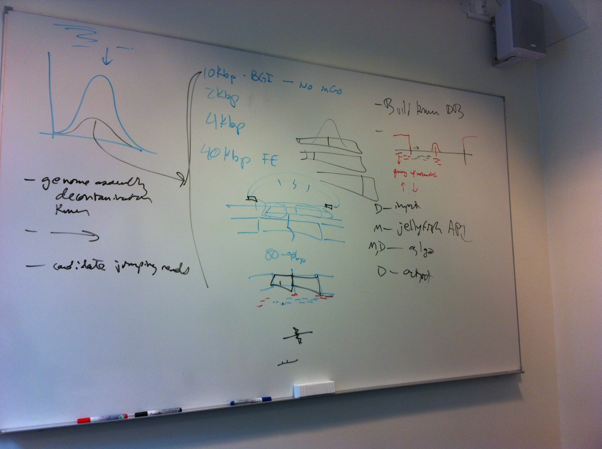

jmers: Kmer-guided processing of jumping reads
==============================================

Clean and process jumping reads using a kmer database built from 'good' sequences of the same genome.  The 'good' sequences are assumed to contain all to nearly all of the kmers found in the target genome, and the jumping reads are assumed to be in various stages of incomplete processing.

Regardless of the protocol used to prepare jumping-read libraries, only the ends of genomic fragments are maintained, with intervening sequence removed and with additional utility sequences added.  Traditional jumping-read processing has involved conservative trim choices due to inability to know with reasonable certainty where the boundaries of the genomic and utility sequences may be found in the fragments ultimately sequences.

Kmer-based processing uses a set of putative 'good' genomic kmers to makes fewer assumptions about what is and is not genomic sequence in jumping-read fragments, and should result in more accurate trimming and, ultimately, longer read lengths after trimming.  Longer lengths of jumping reads enables more accurate mapping and lower link thresholds during scaffolding.

The first target is to process fosmid end sequences.  Some characteristics of the fosmid ends:

1. Production involved a circularisation which ligated the ends of each fosmid together
2. The ligation site is blunt and unknown; it was not created with a restriction enzyme
3. Interior sequence is cut away beginning some distance on either side of the ligation site
4. Utility sequences are attached to these 'inner' ends of the fragment
5. Fosmid-end fragments are sequenced with 250-bp paired-end MiSeq with designed overlap
6. Overlapping with FLASH produces joined fragments around 300-400 bp (will add figure)
7. Conservative trimming resulted in a judgment of keeping the outer 80-90 bp of the end of each joined fragment, after trimming away the outermost 10 bp.
8. We think we can do better than that

Plan:

* Read in 'good' genomic sequences (WGS assemblies, superreads, fosmid pool contigs, etc.)
* Create 'good kmer' database
* Read merged fosmid-end fragments
* Walk each fragment, identifying kmers as genomic or non-genomic
* Trim fragment into read 1 and read 2 appropriately
* Output fosmid end read pair
* Get a better genome assembly in the end

Kmer-walking within known-kmer contexts will be walking through messy kmers
containing sequencing errors.  We might consider doing some simple correction,
perhaps using correction code from some other tool?





Dreaming:

* Extend to mate-pair processing
* Some form of paired-end contamination removal
* Produce candidate subsets of jumping reads: matching 'good kmers' in a sequence subset


Design
------

The namespace is `jmers`.

The `Seq` struct (`Seq.h`) is a simple sequence holder with members `name`,
`comment`, `sequence`, `quality`, `l` (sequence length) and `has_quality` and
methods for `fill()`, `write_fastq()`, `write_fasta()`.

The `Input` class (`Input.h`) is a simple sequence reader that uses Heng Li's
[`kseq.h`](http://lh3lh3.users.sourceforge.net/kseq.shtml) to read FastQ- and
Fasta-format input.  The constructor can receive a filename via `std::string`
or `char *`; `read(Seq&)` method fills a `Seq`, returning `false` if
end-of-file; and `close()` shuts things down.  `Input` can currently handle
uncompressed and gzip-compressed input (via `kseq.h`) but will be extended to
handle bzip2 and xz formats and will also be able to read from stdin/fifo.

The `FosmidEndFragment` class initialises with a `Seq` and implements methods
for inferring boundaries, splitting the fragment after inference into separate
`Seq`s for read1 and read2, and writing them out.

Boundary inference might be better abstracted into a separate factory so that
various fragment types needn't duplicate common inference code, for example
sliding contexts from non-genomic to genomic, genomic to chimeric genomic, and
genomic to non-genomic.  That would also make it easier to add additional
context slides from contaminant (kmer db 1) to noncontaminant (kmer db 2), etc.


```c++
class FosmidEndFragment {
    Seq fragment;
    int64_t end1_pos;      // leftmost inferred start of genomic sequence in fragment
    int64_t ligation_pos;  // inferred site of ligation between fosmid ends in fragment
    int64_t end2_pos;      // rightmost inferred end of genomic sequence in fragment
    FosmidEndFragment(const Seq& s)
        : fragment(s), end1_pos(-1), ligation_pos(-1), end2_pos(-1)
    {
        // is default copy constructor OK?
    }
    void infer_fragment_structure() {
        // fill end1_pos
        // fill ligation_pos
        // fill end2_pos
    }
    Seq read1;
    Seq read2;
    void split_fragment() {
        // use inferred *_pos to fill read1 and read2 from fragment
        // parameters could set buffer around inferred positions, etc., etc.
    }
    write_fragment_pair_fastq() {
        // where is output going...
        read1.write_fastq(read1_ostream);
        read2.write_fastq(read2_ostream);
    }
}
```

```c++
// infer and set end1_pos, ligation_pos, end2_pos using a left-to-right kmer walk
// of the joined fragment
void infer_fragment_structure() {
    // see plan figure for expected profile
    // this may not always apply, especially if the read merging didn't work out well
    // we could provide some parameters to adjust, at both structure inference and fragment splitting
}
```
